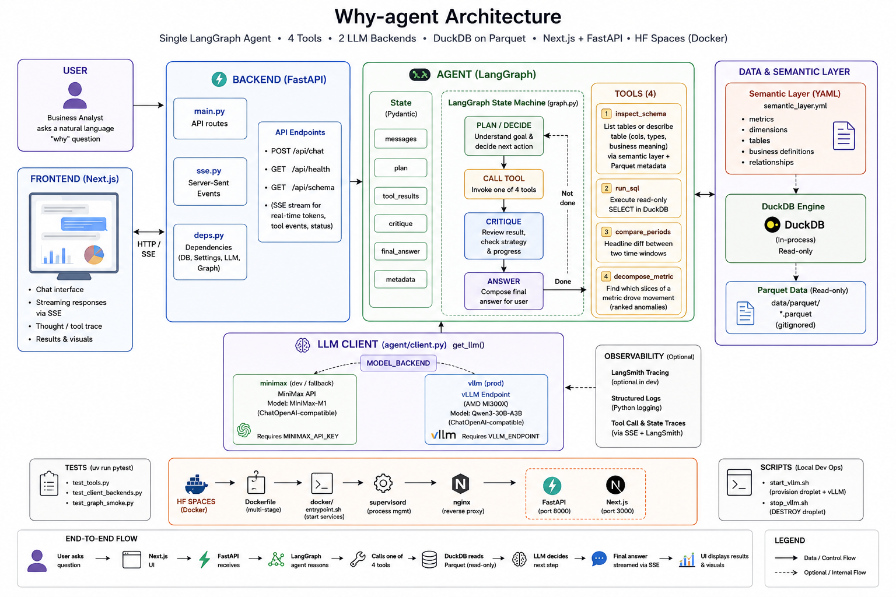

# why-agent — internal working doc

Owners: Mapo, Isa

This is **our** working doc. It's where we record what we agreed on,
why we agreed on it, and who owns what. Update it when decisions change.

---

## 1. What we're building

An autonomous root-cause agent for data. User asks **"why did metric X
move?"** — agent investigates and returns a structured report with an
evidence chain. Works against any user-provided DuckDB/Parquet dataset.
Built on AMD MI300X, deployed to Streamlit Community Cloud.

Working name: **Why Agent**. Repo name: `why-agent`.

---

## 2. Why this, not something else

We considered three other directions and rejected them. The reasoning
matters — it's our defense if we're tempted to scope-creep later.

| Considered | Why we rejected it |
|---|---|
| Multi-agent research over arXiv | Crowded space (Undermind, Elicit, Consensus). No clear users beyond PhD niche. |
| Conflict-aware research agent | Intellectually interesting, no real buyer. "Neat" ≠ "needed." |
| Generic NL-to-SQL agent | Saturated. Every cloud and BI vendor ships one. We can't out-product Snowflake. |
| Multi-agent diagnostic system | One capable agent teaches us more about agent fundamentals than orchestrating several shallow ones. |

What makes *why-agent* the right pick:
- **Real users**: any data team at any company > a few hundred people.
- **Real gap**: only Tellius does autonomous RCA, and it's closed enterprise. No OSS equivalent.
- **Plays to us**: Isa lives this problem at PayPal; Mapo has shipped RAG + agentic systems.
- **Beyond simple RAG**: required by the hackathon brief, naturally true here.

---

## 3. Business insight (the thing this fixes)

Every company runs on metrics. When a metric moves unexpectedly, an
analyst spends 30–90 minutes doing *mechanical* work:

Confirm the drop is real
Decompose by every dimension they can think of
Find the anomalous slice
Drill in further
Cross-check related signals
Write up the conclusion


This is expert-level but repetitive. It's exactly the shape of work
agents do well. But today's tools answer **"what is X?"**, not
**"why did X change?"**.

The market split:
- **Descriptive layer** (NL-to-SQL): saturated. Snowflake Cortex,
  Databricks Genie, Hex, Julius, Looker+Gemini, etc.
- **Diagnostic layer** (autonomous RCA): one closed-source vendor
  (Tellius). Nothing in OSS. **This is where we play.**

Our wedge in one sentence:
> *What Looker shows you, why-agent investigates for you.*

---

## 4. Architecture overview

```
Judge / user                            Cost
│                                  ────
▼
┌──────────────────────────────┐        $0
│ Streamlit Cloud              │
│ https://why-agent...         │
│                              │
│  UI + agent + tools + data   │
│  all in one Python process   │
└──────────────┬───────────────┘
               │ HTTPS, OpenAI-compat
               ▼
┌──────────────────────────────┐        $1.99/hr
│ AMD MI300X droplet           │        (when ON)
│ vLLM + Llama-3.3-70B BF16    │
└──────────────────────────────┘
```



**Three logical pieces:**
1. **The model** — vLLM serving Llama 70B on MI300X. Heavy, expensive.
2. **The agent** — Python code (LangGraph). Light, runs anywhere.
3. **The data** — DuckDB on Parquet + a YAML semantic layer. Tiny.

Everything except the model lives inside one Streamlit app on
Streamlit Cloud. The model is reached via HTTPS to the AMD droplet.

### Why this split

- The model needs a GPU. Nothing else does.
- Streamlit Cloud is free; GPU droplets are $1.99/hr.
- The agent can use Anthropic API as a fallback when the GPU is off.
- Iteration speed: code changes don't redeploy the GPU.

### Three model backends, env-switchable
MODEL_BACKEND=minimax     → MiniMax API (MiniMax-M2.7). Use Days 1-2 (no GPU).
MODEL_BACKEND=vllm        → MI300X. Use Day 3+ for integration & demo.
MODEL_BACKEND=replay      → Pre-recorded traces. For demo when GPU off.

This is critical infrastructure — implement on Day 1.

---

## 5. The agent

### Loop

```
plan → decompose → drill → cross-check → critique → report
↑                                          │
└────── if evidence weak, loop back ───────┘
```

A LangGraph state machine. Each step is an explicit node. State persists
across the whole investigation.

### The four tools

We deliberately have only four. Fewer integrations = fewer demo
failure modes. Hypothesis tracking lives in agent prompt + memory,
not in a tool.

| Tool | Purpose |
|---|---|
| `inspect_schema(table)` | Returns columns, types, sample values, business descriptions from semantic layer |
| `run_sql(query)` | Executes a read-only DuckDB query, returns rows |
| `decompose_metric(metric, dims)` | Slices metric by each dim, ranks slices by anomaly magnitude |
| `compare_periods(metric, before, after, segment)` | Quantifies how a slice changed between two windows |

Tools were cut from six. **Resist re-adding them.** The agent gets
smarter by reasoning better, not by having more tools.

### What "beyond simple RAG" means here

| Simple RAG | why-agent |
|---|---|
| 1 retrieval | Many SQL queries, planned |
| 1 generation | Multi-step loop |
| Static | Hypothesis-driven branching |
| No self-eval | Self-critique before reporting |
| Document-bound | Operates on live structured data |

---

## 6. Data + semantic layer

### Dataset

why-agent works against **any user-provided data** — drop Parquet files
into `data/parquet/` and point the semantic layer at them. There is no
fixed dataset baked into the project.

The current demo dataset is a marketing/CRM extract:

| File | Contents |
|---|---|
| `campaigns.parquet` | Campaign metadata and performance metrics |
| `client_first_purchase_date.parquet` | Customer acquisition timeline |
| `holidays.parquet` | Holiday calendar for seasonality context |
| `messages.parquet` | Message-level send/open/click events |

### The semantic layer

A single `data/semantic_layer.yml` file. ~80–150 lines. Defines:

- **Tables**: events, repos, languages
- **Metrics**: `events_per_day`, `unique_actors_per_day`, `pr_merge_rate`, etc.
- **Dimensions**: `event_type`, `language`, `repo_age_bucket`, `hour_of_day`
- **Relationships**: how tables join
- **Filters**: globally applied rules (e.g., exclude bots)
- **Value labels**: what enum values mean

This artifact is **the contract between Isa and Mapo**. Isa produces
it; Mapo consumes it. Once it stabilizes, both of us build forward
without blocking each other.

---

## 7. Tech stack (locked)

| Layer | Choice |
|---|---|
| Hosting | Streamlit Community Cloud (free, public URL) |
| Frontend | Streamlit |
| Backend | LangGraph agent + tools (pure Python, in-process) |
| Orchestration | LangGraph |
| Model | Llama-3.3-70B-Instruct, BF16 |
| Inference | vLLM on ROCm |
| Hardware | AMD MI300X (1 GPU) |
| Data engine | DuckDB |
| Data format | Parquet |
| Semantic layer | YAML |
| Tracing | LangSmith (free tier) |
| Validation | Pydantic |
| Deps | uv |
| Lint | Ruff |
| Containers | Docker |


## 8. Demo strategy

### Two modes the public URL supports

- 🟢 **Live MI300X mode** — full live agent against the GPU.
  Available during scheduled windows we post.
- 📼 **Replay mode** — pre-recorded canonical investigations,
  played back from saved JSON traces. Always available.
- 💬 **Anthropic fallback** — for ad-hoc judge questions when GPU is off.

### Demo scenarios (rehearsed, deterministic)

1. **Why did message open rate drop in the most recent campaign?**
   Expected: specific campaign/segment underperformance, tied to send-time or audience slice.
2. **Why did new customer acquisition spike in a particular month?**
   Expected: campaign concentration or holiday effect in the acquisition data.
3. **Why is weekend engagement consistently lower than weekday?**
   Expected: structural pattern, agent should distinguish from anomaly.

Scenario 1 is our hero demo.

### One thing to verify early

Run scenario 1 end-to-end on Day 3. If the agent can't reach the
conclusion from the data alone, we need a different question. **Don't
wait until Day 5 to find out.**

---

## 9. Cost & GPU budget

We have $100 in AMD Developer Cloud credits = ~50 GPU-hours.

| Phase | GPU hrs | $ |
|---|---|---|
| Day 0 — validate vLLM + Llama 70B serves | 3 | $6 |
| Days 1–2 — local build (no GPU) | 0 | $0 |
| Day 3 — first integration | 4 | $8 |
| Day 4 — iteration & prompt tuning | 6 | $12 |
| Day 5 — record replays + polish | 8 | $16 |
| Day 6 — demo day | 12 | $24 |
| **Reserve** | **17** | **$34** |
| **Total** | **50** | **$100** |

### Rules
- **DESTROY the droplet, don't stop it.** Stopped droplets still bill.
- Credits expire 30 days after activation. Activate close to use.
- One GPU only — never the 8x ($15.92/hr will burn through credits in 6 hours).
- ~$5 of our own money for a 200GB block volume to cache model weights
  across droplet recreations is a sensible add-on. Worth confirming.

---

## 10. Team split & ownership

The split mirrors the architecture: Isa owns *data + meaning*,
Mapo owns *agent + interface*. The handoff is `semantic_layer.yml`.

### Isa owns
- Demo dataset — Parquet files in `data/parquet/`
- Semantic layer YAML
- Ground-truth validation: "is the agent's answer actually right?"
- Build-in-public post about the data layer

### Mapo owns
- LangGraph state machine + agent loop
- The four tools (Pydantic schemas, implementations)
- LLM client (multi-backend switching)
- Streamlit UI (chat, reasoning trace, replay picker)
- vLLM-on-MI300X setup scripts
- Streamlit Cloud deployment
- Build-in-public post about the agent design

### Shared
- Demo script & live narration
- README, submission video, final pitch
- Day-end sync (15 min) to surface blockers

---

## 11. Day-by-day plan (rough)

| Day | Mapo | Isa | Joint |
|---|---|---|---|
| **0** (pre) | Validate vLLM on MI300X, write `start_vllm.sh`, destroy droplet | Prepare demo Parquet files, drop into `data/parquet/` | Repo scaffolded, README locked |
| **1** | Agent loop + tools against Anthropic API | Draft `semantic_layer.yml` v1 | Agree on tool I/O signatures |
| **2** | First end-to-end agent investigation working | Refine semantic layer, prep demo scenarios | Smoke-test with provided dataset |
| **3** | Switch to vLLM backend, run scenario 1 live | Validate scenario 1 ground truth | First real demo run; identify gaps |
| **4** | Prompt tuning, self-critique node | Scenario 2 + 3 ground truth | Build-in-public posts |
| **5** | Streamlit polish, record replays, deploy to Cloud | Final dataset cleanup, write evaluation notes | Rehearse demo |
| **6** | Final fixes, submission prep | Final fixes, submission prep | Submit + pitch |

### What's allowed to slip
- Scenario 3 (the structural-pattern one)
- Streamlit polish beyond functional
- Build-in-public posts after the first two

### What is NOT allowed to slip
- Scenario 1 working end-to-end by Day 3
- Public URL up and demoable by Day 5
- Replay mode working by Day 5

---

## 12. Risks & open questions

### Risks we can name today

1. **vLLM-on-MI300X setup stalls Day 1.** Mitigation: validate on Day 0,
   keep Anthropic API fallback always wired.
2. **The "right answer" for our chosen scenario isn't reachable from
   the data alone.** Mitigation: pick scenario on Day 0; smoke-test
   end-to-end by Day 3.
3. **Streamlit Cloud RAM limit exceeded by data + agent + LangGraph
   process overhead.** Mitigation: keep Parquet files under 300 MB total; profile
   on Day 2.
4. **Live demo timing variance — agent takes 90s instead of 60s.**
   Mitigation: don't claim "60 seconds"; frame as "minutes vs hours."
5. **One of us gets sick.** Mitigation: README + repo are clear enough
   the other can demo solo.

### Open questions to resolve early

- [ ] Which specific question is our hero demo?
- [ ] Is the semantic layer accurate enough for the demo dataset?
- [ ] Do we pay $5 for the model-weights block volume?
- [ ] Do we want a custom domain, or is `*.streamlit.app` fine? *(default: streamlit.app fine)*

---

## 13. Working agreements

- **Decisions go in this doc.** If we changed our minds, edit it. No
  re-litigating in chat.
- **Day-end sync, 15 min.** Just blockers and tomorrow's priority.
- **Push to main freely until Day 4.** From Day 5: PRs only.
- **No new tools, libraries, or scope past Day 3** without explicit
  agreement from both of us.
- **The semantic layer is a contract.** Once stable, breaking changes
  require a heads-up.

---

## 14. Implementation status

| Component | Status |
|---|---|
| LLM client — 3 backends (`minimax`, `vllm`, `replay`) | ✅ done |
| Pydantic state model (`InvestigationState`) | ✅ done |
| LangGraph state machine (6-phase loop) | ✅ done |
| `inspect_schema` tool | ✅ done |
| `run_sql` tool | ✅ done |
| `compare_periods` tool | ✅ done |
| `decompose_metric` tool | ✅ done |
| System + critique prompts | ✅ done |
| REPL for local testing | ✅ done |
| Streamlit UI | ⬜ pending |
| Demo dataset in `data/parquet/` | ✅ done |
| Replay recording script | ⬜ pending |
| vLLM Docker + MI300X scripts | ⬜ pending |

---

## 15. Getting started (dev setup)

```bash
# Prerequisites: Python 3.12+, uv installed
git clone https://github.com/Isa-Mapo-Hackathon/why-agent
cd why-agent
uv sync

# Copy and fill in .env
cp .env.example .env
# Set MINIMAX_API_KEY (get from MiniMax dashboard)
# PARQUET_DIR defaults to data/parquet — point at data/dev for the toy dataset

# Run the test suite (77 tests, no network required)
uv run pytest

# Interactive REPL against the real MiniMax API
uv run python scripts/repl_graph.py
# > Q: Why did PR activity drop on Oct 21 2018?

# Lint + format (must be clean before any commit)
uv run ruff check --fix && uv run ruff format

# Run Streamlit app (UI not yet built — skeleton only)
uv run streamlit run streamlit_app.py
```

### Environment variables

| Variable | Required | Description |
|---|---|---|
| `MODEL_BACKEND` | Yes | `minimax` / `vllm` / `replay` |
| `MINIMAX_API_KEY` | When `MODEL_BACKEND=minimax` | MiniMax API key |
| `VLLM_ENDPOINT` | When `MODEL_BACKEND=vllm` | e.g. `http://host:8000/v1` |
| `REPLAY_SCENARIO_ID` | When `MODEL_BACKEND=replay` | Scenario JSON filename (without `.json`) |
| `PARQUET_DIR` | No | Path to Parquet files (default: `data/parquet`) |
| `SEMANTIC_LAYER_PATH` | No | Default: `data/semantic_layer.yml` |

---

## 16. Pointers

- AMD Developer Hackathon: https://lablab.ai/ai-hackathons/amd-developer
- AMD Developer Cloud docs: https://www.amd.com/en/developer/resources/cloud-access/amd-developer-cloud.html
- LangGraph docs: https://langchain-ai.github.io/langgraph/
- vLLM on ROCm: https://docs.vllm.ai/en/latest/getting_started/amd-installation.html
- Streamlit Cloud: https://share.streamlit.io